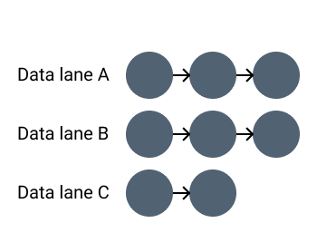
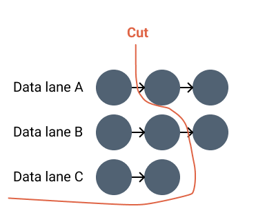
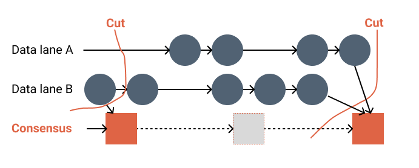

# Consensus

Autobahn is the next-generation consensus protocol that Hyli uses. It delivers high throughput and fast recovery through a novel two-layer design: parallel data lanes and BFT-based snapshot consensus.

## The problem: traditional consensus stalls

Most consensus protocols today (like PBFT, HotStuff, or Tendermint) assume failure is rare and recovery is fast.

In practice:

- Networks experience regular disruptions and latency spikes.
- Throughput is bottlenecked by leader-based message propagation.
- After a fault, most systems stall or slow down before stabilizing, a phenomenon we refer to as a “hangover”. This happens because the data in the blocks is not committed: the next block after the fault will contain all the missed transactions, making it even harder to broadcast than before the fault occurred.

These issues create a ceiling for scalability, especially under real-world conditions.

## The solution: Autobahn

Hyli uses **Autobahn**, an upcoming consensus protocol that combines high throughput, a steady commit pace, and seamless recovery from network disruptions or Byzantine faults.

The price we pay for this stability is more message deliveries, and therefore slightly higher latency, than in traditional consensus protocols. [Pipelined proving](./pipelined-proving.md) allows Hyli to keep offering an ultra-fast experience.

Autobahn combines two separate layers:

- **Data dissemination** through parallel “lanes” per validator.
- **Consensus** finalizes a snapshot of all lanes. Thanks to the separation of the two layers, the consensus message remains fixed in size, regardless of the amount of data being finalized.

### Why Autobahn helps developers

- High throughput, even complex or high-volume apps
- Fast recovery even when the network blips
- Lightweight nodes that are cheaper to run and easier to scale
- Low latency if you use a rollup-centric approach, so a local node deals with the proofs before the data is broadcast to the rest of the network

### Data dissemination via lanes

Each validator maintains a “lane,” a local chain of data proposals (which would be called “blocks” on a legacy blockchain) that they produce and broadcast.

Data proposals are broadcast and certified with threshold signatures. A proof of availability is created when one-third of the validators have seen and acknowledged a block. That way, availability is guaranteed *before* entering consensus.

This is good for three reasons.

**Consensus doesn’t wait for data**: in most protocols, validators must download and verify all the data during the consensus process. If the data is large or delayed, the consensus slows down or stops altogether. With the proof of availability on Autobahn, validators check availability before voting. This means that consensus messages are a constant size (since they don’t need to include the data), so consensus stays fast.

**Consensus can settle many blocks at once**: proof of availability certifies an entire chain of previous blocks. Finalizing the end of the lane means you finalize everything before it. This way, consensus can commit hundreds of blocks in a single round.

**Recovery is fast**: every node is the leader of its own lane. When consensus stalls because of a faulty consensus leader, data dissemination from all the other nodes continues: catch-up is easily achieved by pulling the tip of each lane and verifying proof of availability without needing to re-run consensus on the missed blocks. This means that after faults, you have a smooth, near-instant recovery.

### Consensus: fast finality with tip cuts

In the consensus phase, a rotating leader collects the hash and proof of availability (PoA) of the latest block in each lane. The leader doesn’t need the full blocks, since availability has already been verified. It then proposes a snapshot of these lane tips, called a **cut**, as a way to advance the data stream progression.

All validators vote in a two-round Byzantine Fault Tolerant (BFT) consensus to finalize this cut. After that, all blocks before and up to that cut are considered finalized.

As the data has already been verified outside of the latency-critical path, the finality is fast.

## Performance

Autobahn offers horizontal scalability: it parallelizes data dissemination through lanes, meaning that the more validators you have, the more lanes you have. In other words, bandwidth goes up with the number of validators.

We are currently in our first testnet phase; we’ll add real-life performance once this phase is over.

We encourage you to [read Sei Labs’ benchmark](https://blog.sei.io/sei-giga-achieving-5-gigagas-with-autobahn-consensus/) to see their results.

## Security

Some notes on the moderl's security:

- It is safe as long as two-thirds of the validators are trustworthy.
- The proof of availability signatures are threshold-based and slashable.
- Safety and liveness are ensured even with partial asynchrony.

## Resources

- [Autobahn whitepaper](https://arxiv.org/abs/2401.10369). All images in this page are derived from the Autobahn whitepaper.
- [Commonware: Ordered Broadcast](https://commonware.xyz/blogs/commonware-runtime.html)
- [Sei Labs Autobahn Benchmark](https://blog.sei.io/content/images/size/w2000/2025/02/5362633a-39ec-45ec-a66b-0e72fda1a11e.png)