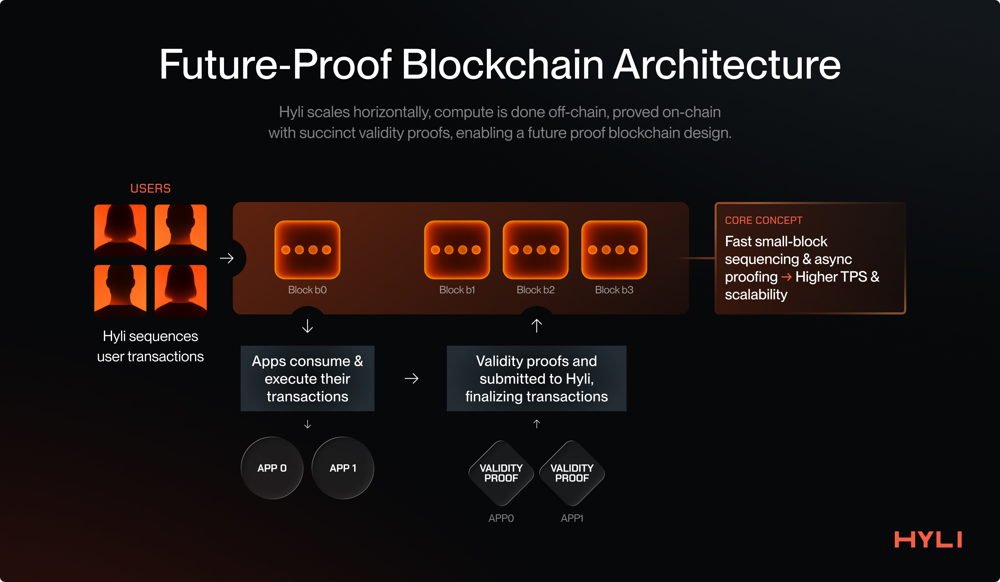
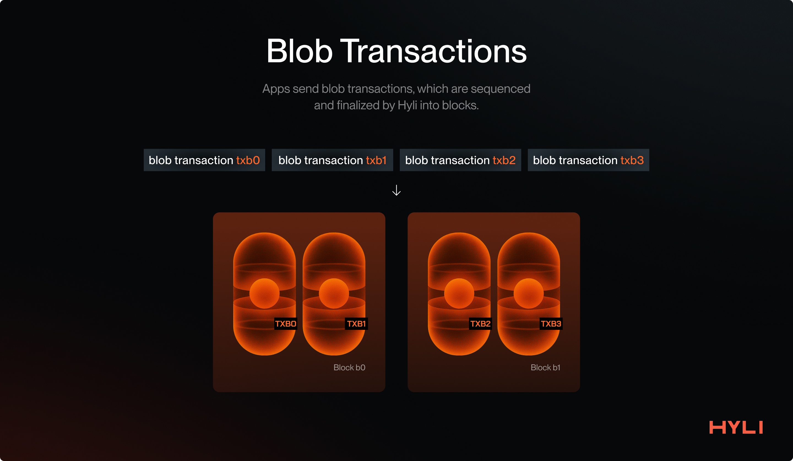
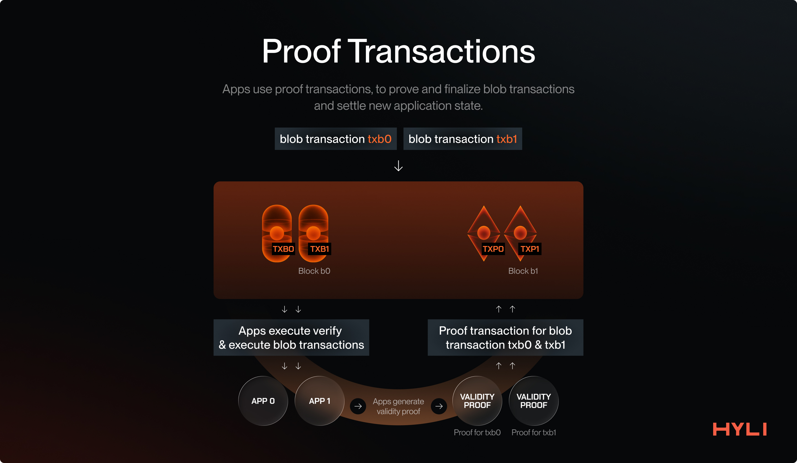
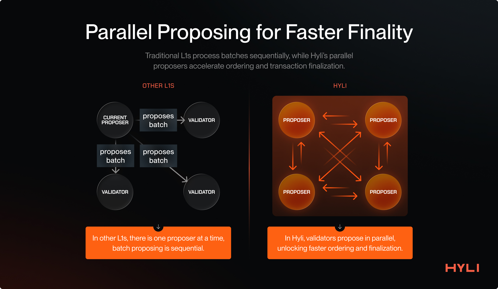
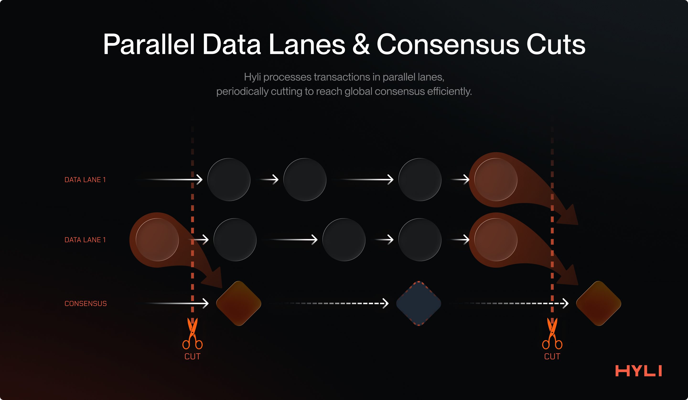

# Core components of Hyli

This section introduces various primitives and components that Hyli has developed to implement a novel Layer 1 that can meet the world’s demand for computation.

## Offchain execution

**Hyli's design is opinionated, focusing only on sequencing, data availability, and verifying zk proofs.** This focus enables it to delegate computation to apps. Since execution is verifiable thanks to cryptographic techniques, the system remains decentralized and trustless.

[Traditional Layer 1s](../concepts/hyli-vs-vintage-blockchains.md) suffer from a lack of horizontal scalability as they pursue a single layer with all components integrated: sequencing, validation, execution, and state. They become bottlenecked as the demand for execution and state increases.

An increase in demand for these L1s means managing more application state and more computation on a single layer. To meet the demand, they increase resource requirements for validators: larger and faster disks, higher network bandwidth, more RAM, and more computer cores.

This is where Hyli shines.

Hyli [only sequences the transactions](../concepts/transaction.md) for applications. The [applications](../concepts/apps.md) are responsible for validating these transactions, executing them, and managing the application state. This allows Hyli to scale horizontally because all applications handle their validation, execution, and state management.

Hyli scales decentralized applications the way the internet has scaled, which is through horizontal scaling, and hence is pursuing the endgame architecture of building a universal proof layer.

## Transactions on Hyli

[Read more about transactions on Hyli](../concepts/transaction.md).

Hyli provides two transaction types, which are:

- Blob transactions  
- Proof transactions

Let’s take a look at both individually.

### Blob transactions

Hyli is the source of truth for the order of transactions for applications.

Blob transactions provide an application transaction to be sequenced (ordered) and finalized on Hyli. This transaction contains a payload, which includes data that an application can use to verify and execute it.

This way, multiple application transactions are sequenced and finalized on Hyli, and their verification and execution are handled directly by the applications.

## Proof transactions

After your transaction has been sequenced and finalized on Hyli, the application executes it and needs to settle the application state post-execution.

This is where Proof transactions come into play.  

Once a transaction has been sequenced on Hyli, a Proof transaction follows, accompanied by a proof and the new application state. Once a proof transaction has been provided and successfully verified for a previous blob transaction, that blob transaction and its corresponding application state can be considered settled.

[Read more about transactions on Hyli](../concepts/transaction.md).

### Why separate sequencing from proving?

Having separate transactions for sequencing and proving an application enables a Web2-like user experience while maintaining decentralization and security. Proving will never be fully instantaneous, and pipelined proving easily removes this overhead time.

For example, imagine doing a swap on Hyli, rather than waiting for a proof to be generated:

1. The user transaction is immediately sequenced.  
2. The application immediately executes it and provides the latest application state to the user (which would be confirmation that their swap is done).  
3. The user can keep using the app. Meanwhile, the new state proving happens asynchronously in the background. The app will roll back if proving fails.

This has the added benefit of avoiding initial state conflicts.

[Read more about pipelined proving on Hyli](../concepts/pipelined-proving.md).

## Consensus: Autobahn

Hyli is pursuing a new design by only focusing on sequencing and verifying proofs. This means that it doesn’t get bottlenecked by onchain computation and the corresponding state growth.

This also means that **the faster Hyli can propagate data and finalize transactions, the faster the apps built on top of Hyli will be**.

This is why Hyli uses [Autobahn](https://arxiv.org/pdf/2401.10369) as its consensus mechanism. It allows multiple concurrent proposers and uses data availability certificates for fast finality.

Autobahn enables Hyli to process more data and finalize transactions faster than traditional BFT consensus algorithms, such as Tendermint. It makes Hyli **the best choice for building low-latency, high-throughput applications**.

Multiple concurrent proposers also provide censorship resistance: transactions are sent to multiple validators to ensure inclusion, even if one of them is censoring the user.

 

In Autobahn, every proposer maintains its unique lane, where it proposes new batches and disseminates them to other validators. In parallel, validators finalize various batches into a single block. A block is finalized once it has received a threshold number of signatures.

The approach helps decouple data dissemination from the consensus over this data, unlocking higher throughput and faster finality.

Autobahn makes Hyli the destination for building high-throughput, low-latency applications, from onchain games to onchain order books.

[Read more about consensus on Hyli](../concepts/consensus.md).

## Application architecture on Hyli

Hyli provides a new infrastructure for building the next generation of scalable, secure, cryptographically protected applications. This also means building an application differs from the traditional developer experience of using smart contracts.

Let’s dive deep into the various components of building an app on Hyli.

There are a few important things an application needs:

1. Ordering of transactions  
2. Execution of the app logic for the finalized transactions  
3. State updates after successful execution

### Ordering of transactions

Hyli takes care of this part.  
With its Autobahn consensus under the hood, it provides very fast sequencing so builders know what base state they need to use for their proof.

### Execution of finalized transactions

Users send the actions they intend to take (such as making a swap or buying a game asset) via blob transactions, which Hyli sequences and finalizes.

Once transactions have been finalized on Hyli, applications can start consuming their respective transactions and verifying and executing the app logic. For this, applications host their apps off-chain. Unlike smart-contract-based execution, this approach enables Hyli to break free from the burden of onchain computation and state, which is a significant bottleneck for other L1s.

The application executes its transactions and creates a proof of successful execution using whatever stack works best for the developer. Users interact directly with the application to get the status of their transaction's execution.

As more applications come, the system scales horizontally and doesn’t burden or hamper Hyli.

### State updates

This is the final stage of executing an application transaction: committing the latest state of the application after a transaction has been executed. This ensures the application's verifiability and also protects users in various scenarios, such as withdrawing funds from the application.

Applications on Hyli maintain their state off-chain and can leverage various storage options, including decentralized storage providers such as Arweave, Filecoin, and Walrus, or centralized ones like Amazon S3 and Cloud Storage.

Applications only commit a small, fixed-sized commitment to their application state and periodically publish new state roots after applying a transaction, along with a validity proof.

This allows Hyli to escape the state growth problem, which has plagued blockchains since their dawn.  
On legacy blockchains, as more applications emerge and grow, so does their storage, which every validator in the network must bear.  
Hyli enables provable applications with validity proofs. Applications only submit their latest state commitment; the state remains off-chain, but all updates to the application are verifiable via validity proofs, allowing the state to be easily reconstructed.

This enables the creation of bulletproof, secure, and scalable apps that are sustainable over time as they grow.

## Practical example: a Dex on Hyli

Let’s take the example of a transaction of a Dex product on Hyli and examine the lifecycle of a user transaction.

### Step 1: User sends a transaction

The user sends transactions describing their intended actions, such as deploying liquidity, withdrawing liquidity, or swapping.

At this point, nothing has been proved.

### Step 2: Dex application consumes the transaction

The Dex application follows the Hyli L1 with the help of an indexer. It consumes every new block, filters out the transactions intended for itself, applies the application logic, and updates the respective state.

The developer is free to write their application in any language of their choice as long as they can generate a validity proof for it\! This could be Rust, C++, or domain-specific languages like Cairo, Noir, Circom, etc.

The application state typically resides in a decentralized storage layer.

### Step 3: User gets confirmation on their transaction

Users don’t need to wait for their transaction to be proven to get a confirmation. The application provides immediate confirmation post-execution and updates its state temporarily. This is a softer confirmation than the proof being settled, but since the application generates validity proofs, it cannot lie to the user.

This enables the creation of a real-time user experience for our Dex. The user sends the transactions, which are immediately finalized and executed, and then the user is free to take any business action on top of it.

### Step 4: Transaction is proven and settled

The application asynchronously proves all transactions. This proof can be generated by a prover network like Boundless or Succinct, by the application itself, or event client-side: in the context of our Dex, the app generates the proofs.

Once the proof has been generated, the application finalizes the transaction with a proof transaction, which also includes the app's new state commitment.

Since applications built on Hyli provide validity proofs, everything the indexer follows and operates on top is proved and verified on Hyli for integrity. Hyli verifies the proof and settles the transaction, updating the application's new state onchain. What was "sequenced" is now "confirmed": the app can update its state for good and the user gets a final confirmation.

Hyli's approach to building applications enables the creation of scalable, secure, verifiable, and censorship-free apps that deliver real-time, Web2-like latencies and user experiences.

Hyli is the endgame for building verifiable apps!
