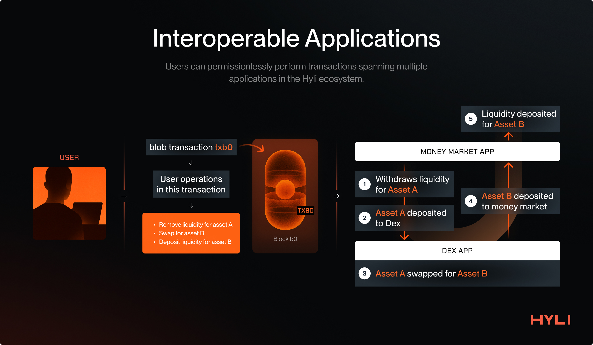
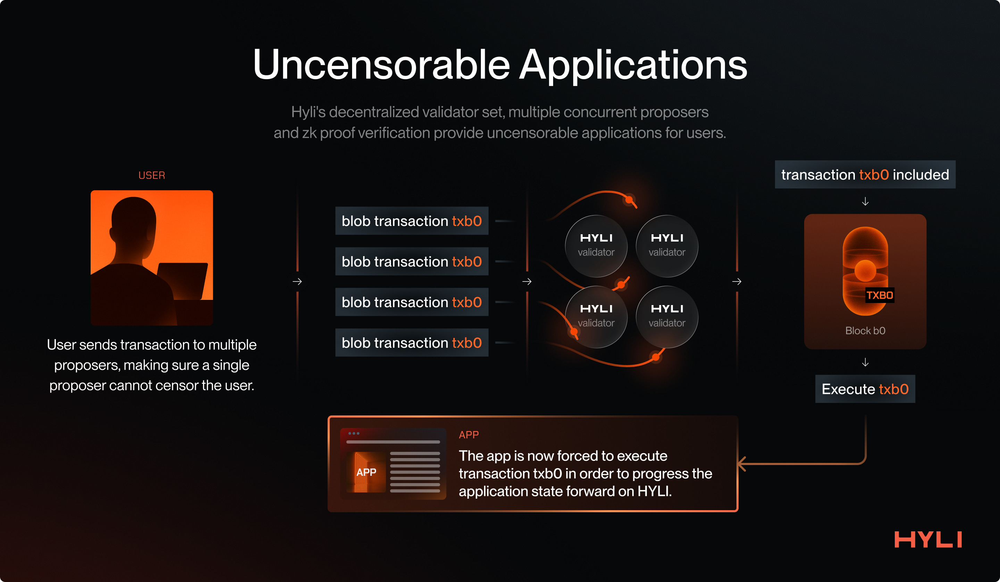
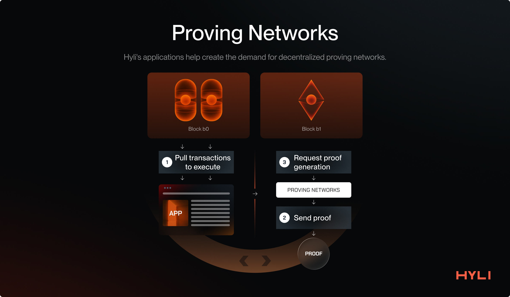

# A vision of the future with Hyli

This final section of the guide discusses the future that Hyli aims to bring forward. Discussions span from the end-user experiences that Hyli will make possible to the evolution of infrastructure and new market opportunities the stack can create.

## A world full of verifiable apps on Hyli

Hyli is the next evolution of user applications: sovereign, verifiable, and censorship-resistant. Applications built on Hyli offer these properties without compromising on user experience and speed.

One of the key features of applications built on top of Hyli is their ability to interoperate with each other easily. Multiple instructions can be sent via a single blob transaction, and through sync and async protocols, a single transaction can span across multiple applications.

### Interoperable Applications

You could withdraw liquidity from a money market, swap with the asset on a different application, and deposit liquidity for the swapped asset back to the money market, all in a single transaction. And each of these apps is a different rollup: no need for bridges, everything is natively composable.

Hyli is building the settlement layer of the next wave of internet applications, enabling anyone to perform multiple interactions with these applications in a single transaction. It’s a better way to build applications.

### Private Apps

One of the key components in the Hyli architecture is that applications only post state commitment to Hyli, so the application state itself is off-chain: the proof is what guarantees the integrity of any action, even if the details of the action are not made public. This enables the development of private applications on Hyli.

Take, for example, a private payments app. In such a system, each user's balance is encrypted and private by default. Users generate zero-knowledge proofs that their transactions are valid (e.g., that they own sufficient funds and are transferring them correctly) without ever revealing their balance or transaction history.

Because of Hyli’s design, we can achieve both privacy and high TPS, which is not imaginable on the vast majority of privacy-first chains.

These proofs are submitted onchain, and the protocol verifies them without decrypting the underlying data. This enables full privacy while maintaining the system's integrity.

Hyli, due to its high data throughput, serves as the backbone for the construction of a new wave of privacy-focused applications, where Hyli handles ordering and censorship resistance. At the same time, apps focus on fast, privacy-protecting execution.

### Uncensorable Applications

Hyli is building the common source of truth for the new wave of internet applications. Hyli verifies proofs of what has happened (user transactions) and in what order.

Applications on Hyli must respect transactions sent to Hyli and their order, as this is a core part of their application logic that needs to be verified on Hyli to advance the application state.

Hyli’s innovation lies in its fast data dissemination and finality via Autobahn. Users directly submit their transactions to Hyli, where they are finalized very quickly. Once finalized, transactions are guaranteed for execution by the corresponding applications.  

Hyli has multiple concurrent proposers, which means users can send their transactions to multiple proposers in parallel, protecting them from being censored by a single proposer. This ensures that both Hyli and its applications are censorship-resistant for their users.

## Proving Networks

Hyli enables verifiable, censorship-resistant applications and leverages proofs as a core part of building these applications: Hyli applications rely on proving their application logic.

Rather than execute code directly on a blockchain, the provers and proving networks become the execution engine: the code is executed there, proven, and verified on Hyli.

Teams like Boundless, Succinct, Fermah, and zkCloud have been working on decentralized proving networks.

A proving network as a piece of infrastructure ensures that applications on Hyli:

- Don’t have a central point of failure  
- Get the most cost-efficient and fastest proving services  
- Benefit from highly efficient proving infrastructure

In a decentralized proving network, operators compete to be the fastest, the cheapest, and the most reliable. At the same time, multiple providers eliminate any central point of failure.

The Hyli stack, along with its wave of new internet applications, will create sustained demand for these proving networks, thereby also accelerating cheaper and faster proving. This will have a net positive impact on the ecosystem.

## The fastest, most abundant DA layer

Hyli, with its Autobahn consensus, is all set to break the limits of how fast data can be disseminated and finalized by a decentralized set of validators.

Since Hyli focuses only on data availability and proof verification, it is laser-focused on scaling these two properties:

- The amount of data that can be propagated, finalized, and made available;  
- The number of integrity proofs that the chain can verify per second.

The above focus makes Hyli the default choice for applications looking for a data availability solution.

Applications such as chat applications, AI agents, decentralized courts, and governance platforms can all utilize Hyli to store their data and make it available for a meaningful period.

Hyli will continue to push the metrics on data availability, speed of finalization, and the number of proofs it can verify, leveraging ever-improving technology and the continuous decentralization of its validator set. Hyli is well-positioned to be the world’s fastest, most abundant DA layer.

Follow [Hyli on X](https://x.com/hyli_org) to stay updated with the latest developments in the Hyli ecosystem and explore [our roadmap](../resources/roadmap.md).
