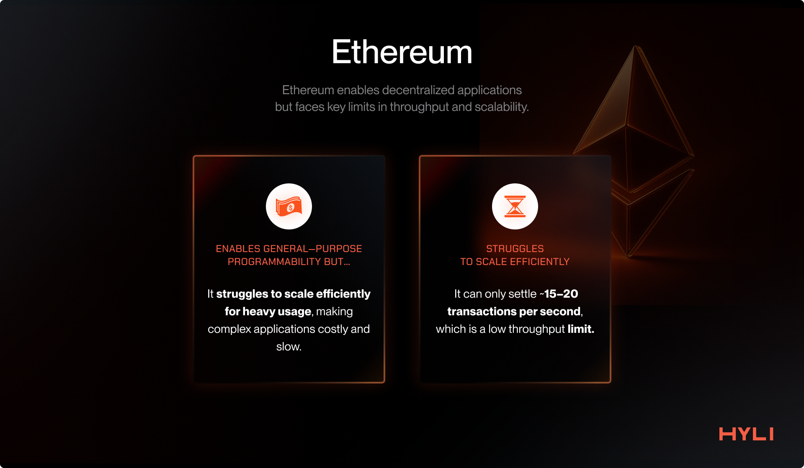
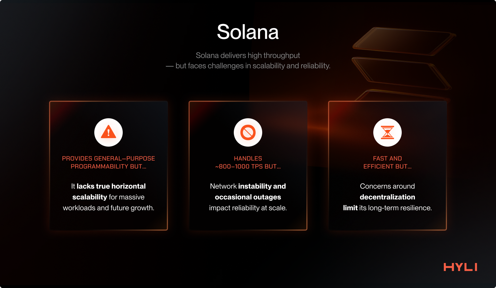
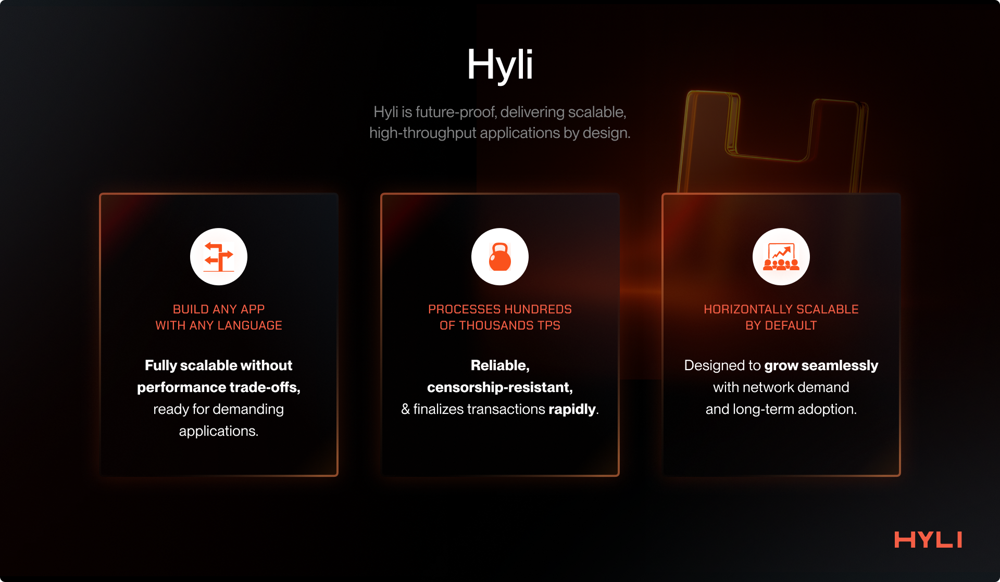

# Why Hyli?

Blockchains today have issues.

When the Hyli co-founders first thought of the blockchain they wanted to create, zero-knowledge proofs had become very practical to scale execution. This made them wonder: Why does the L1 even handle execution? Why not just sequence the transaction and verify the proofs? And if something other than zero-knowledge proofs appeared, how would that L1 support it?

So the question was **how to create a new Layer 1 with a future-proof architecture that can scale and solve these limitations**. The answer: a Layer 1 that can horizontally scale thanks to validity proofs, handle millions of TPS, and never get burdened with the ever-growing onchain state.

This section explores why we work on Hyli. As you read, you’ll understand why the Hyli architecture is the endgame of blockchain infrastructure.

## A history of blockchain architecture

Let’s start by recapping the evolution of blockchain architectures. That way, we can understand how we arrived at this point and the next set of challenges that the Hyli architecture addresses.

### Bitcoin: The first app chain

It all starts with Bitcoin, an app-specific chain built after the 2008 financial crisis to solve the problems of sound money.

Bitcoin tackled the hard problems of that time: creating a sound digital asset that is permissionless to use, offers self-custody, and is secured by mathematical and economic security.

Bitcoin solved critical problems, but it had issues:

- Not scalable, \~7 TPS  
- Not highly programmable. You cannot build complex applications with it.

![][image1]

Following the creation of Bitcoin, people started building app-specific chains.

The issue with the model is that economic security cannot be shared between these app chains, and every app needs to bootstrap its economic security from scratch.

### Ethereum: The first general-purpose chain

Ethereum was launched to solve the lack of **general-purpose programmability**.

It ships with the EVM (Ethereum Virtual Machine), which allows for launching a suite of applications on the same base chain. This has led to the boom of DeFi and primitives such as AMMs, Money Markets, and NFTs.

All these apps could launch directly on top of Ethereum, inheriting its economic security.

However, Ethereum operates at \~15-20 TPS and thus becomes very expensive to use during periods of high usage and congestion.

Ethereum did not solve the scalability problem.

### Solana: The first high-throughput general-purpose chain

Solana was launched with a new execution model, incorporating parallelization to provide high throughput on a general-purpose chain.

Now, you can build onchain apps and distribute them with low fees.

Solana currently achieves \~1,000 true TPS and plans to grow that number.  

Solana has inspired multiple other chains that also aim to increase throughput, such as Sui, Aptos, Sei, Monad, etc.

## Problems with existing Layer 1 architecture

General-purpose high-throughput chains are emerging. However, we haven’t yet solved the scaling problem.

**No single chain can be the world computer.**

To scale and meet the demand for decentralized, permissionless, and trustless computing, Layer 1s have focused on scaling a single chain vertically.

This quest is misguided. The truth is that the internet itself has scaled horizontally. There is no single server that meets the world's demand for Web2 applications, and the same holds true for blockchains.

You can build a 100k+ TPS chain, but eventually, the world’s demand will grow enough that scaling onchain compute will be a problem again. You cannot solve blockspace congestion, slowness, and high fees by scaling a single chain.

The ultimate goal is a horizontally scalable, decentralized infrastructure for building applications.

**Proofs open up a new design space.**

The current innovation in cryptography, particularly zero-knowledge proofs, has enabled a new approach to building verifiable applications.

Rather than relying on multiple machines replicating the same app logic, a single validity proof can be generated. The proof makes the app's state instantly verifiable for millions of devices, even those that would not be powerful enough to execute the app’s logic.

This paves the way for a new blockchain architecture where applications run computations off-chain and periodically settle proof of their state transition to a common settlement layer.

**The Layer 1 of tomorrow must do sequencing, DA, and verification of validity proofs. Nothing else.**

With zero-knowledge proofs, now the Layer 1 can just focus on:

- Sequencing: ordering transactions for applications  
- Data availability: making sure that the data is available for verification  
- Verification: verifying that applications are working correctly and settling onchain accordingly

This way, all the computation can be left to the choice of app builders. An app can use a Layer 1 to order transactions and resist censorship while providing periodic proofs of its correct behavior.

## Hyli: speedrunning the Layer 1 endgame

We introduce Hyli, a Layer 1 that fixes the issues outlined above.

Hyli is a new Layer 1 blockchain that focuses only on sequencing, data availability, and proof verification. The computation is handled directly via the apps. This lays the foundation for a horizontally scalable, decentralized network of applications that are performant, secure, and interoperable.

This novel architecture allows us to focus only on increasing speed and scalability, allowing us to design and innovate in ways that traditional general-purpose Layer 1s cannot.

Hyli uses various new primitives to ship the fastest and most cost-effective L1 of its type. It uses AutoBahn, a new consensus with Multiple Concurrent Proposers, for faster data propagation and finalization.

It enshrines various proof system verifications, allowing for the building of verifiable apps with superior DX. zkVMs, such as SP1 and RISC-0, and zkDSLs, like Noir, are already live on Hyli, with more in the pipeline.

**Hyli allows you to just build your app**.

Bring your zkVM and use whatever language you want. You get censorship-resistant ordering and verifiability out of the box, allowing you to focus on building and distributing your app.

The use of a common sequencing and verification layer also enables interoperability between all Hyli-based apps without bridges.

Most importantly, this architecture scales horizontally. As more clients join the network, verifications are horizontally distributed among them and do not reach the bottleneck that the current L1s have been suffering from, thanks to our state-of-the-art consensus protocol based on Autobahn.
