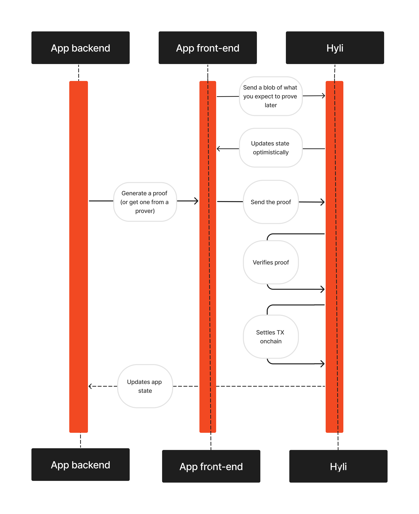

# Home

[Hyli](https://hyli.org/) is the settlement layer for private, compliant stablecoins and tokenized assets.

Hyli enables financial institutions and enterprises to build private stablecoins and tokenize real-world assets with cryptographic privacy guarantees and regulation-grade compliance through selective disclosure.

By separating execution from verification and leveraging cryptographic proofs, Hyli combines Web2 scalability with Web3 trustworthiness.

## Navigation

-   :material-home:{ .lg .middle } __Hyli guide__

    ---

    Your entry point to understanding Hyli, with minimal code.

    [:octicons-arrow-right-24: Guide](./guide/index.md)

-   :material-clock-fast:{ .lg .middle } __Quickstart__

    ---

    Get started with Hyli in just a few minutes with a step-by-step annotated quickstart.

    [:octicons-arrow-right-24: Quickstart](./quickstart/index.md)

-   :material-lightbulb:{ .lg .middle } __Concepts__

    ---

    Hyli-specific concepts and Hyli's spin on industry classics explained in detail.

    [:octicons-arrow-right-24: Concepts](./concepts/index.md)

-   :material-tools:{ .lg .middle } __Tooling__

    ---

    Hyli tooling to improve your building experience.

    [:octicons-arrow-right-24: Tooling](./tooling/index.md)

[Reach out on Telegram](https://t.me/hyli_org) or [open an issue](https://github.com/hyli-org/devhub-hyli) if you need assistance or wish to provide feedback on the documentation: we're always looking to improve.

## How Hyli works

Here’s what happens when you use Hyli’s next-generation Layer 1:

1. __Write your app__: Define how your contract updates state. Run your logic offchain in Rust, Noir, or any supported language. Choose your proving scheme and leverage Hyli’s native signature verifiers.
1. __Send a blob transaction__: Submit a provable blob to Hyli that specifies your expected post-transaction state. Hyli sequences it instantly, giving you a timestamp and a guaranteed position in the block. [Read more about pipelined proving](./concepts/pipelined-proving.md).
1. __Generate and submit the proof__: Produce proofs locally, in a browser, or through a proving network. When ready, submit them in a proof transaction referencing your blob.
1. __Finality__: Validators verify proofs natively, eliminating VM overhead. If the proof is valid, Hyli finalizes the transaction and settles it onchain.

## What you get with Hyli

Hyli delivers privacy, compliance, and performance for financial applications.

- Transaction-level confidentiality: sensitive data never touches the public ledger.
- MiCA-compliant selective disclosure for regulators.
- No blockchain expertise required: build with familiar tools and languages.
- Identity abstraction with the [Hyli wallet](./concepts/identity.md).
- [Composable proofs](./concepts/proof-composition.md) across contracts and [languages](./reference/supported-proving-schemes.md).
- State-of-the-art [Autobahn consensus](./concepts/consensus.md) for fast finality.

Read more about [how Hyli compares to legacy blockchains](./concepts/hyli-vs-vintage-blockchains.md).

## Useful links

- :fontawesome-solid-circle-nodes: [Rust node](http://github.com/hyli-org/hyli)
- :material-home: [Website](https://hyli.org)
- :material-rss: [Hyli blog](https://blog.hyli.org)

## Let's talk

Reach out to the team for more information:

| :fontawesome-brands-github: Github | :fontawesome-brands-twitter: Twitter | :fontawesome-solid-archway: Farcaster | :fontawesome-brands-linkedin: LinkedIn | :fontawesome-brands-youtube: Youtube |:fontawesome-brands-telegram: Telegram|
|-------------------------------------|--------------------------------------|--------------------------------------|--------------------------------------|--------------------------------------|--------------------------------------|
| [Hyli](https://github.com/hyli-org) | [@hyli_org](https://x.com/hyli_org)  | [@Hyli](https://farcaster.xyz/hyli-org) | [Hyli](https://www.linkedin.com/company/hyli-org/) | [@Hyli](https://www.youtube.com/@hyli-org) | [Hyli](https://t.me/hyli_org)|
