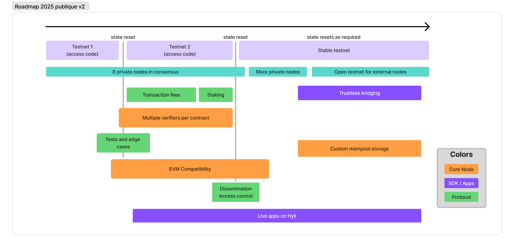

Directory Structure:

└── ./
    └── docs
        ├── concepts
        │   ├── .pages
        │   ├── apps.md
        │   ├── hyli-vs-vintage-blockchains.md
        │   ├── identity.md
        │   ├── index.md
        │   ├── pipelined-proving.md
        │   ├── proof-composition.md
        │   ├── proof-generation.md
        │   └── transaction.md
        ├── quickstart
        │   ├── .pages
        │   ├── devnet.md
        │   ├── index.md
        │   └── scaffold.md
        ├── reference
        │   ├── .pages
        │   ├── devnet.md
        │   ├── index.md
        │   ├── node.md
        │   └── supported-proving-schemes.md
        ├── resources
        │   ├── .pages
        │   ├── find-us.md
        │   ├── glossary.md
        │   ├── grants.md
        │   ├── index.md
        │   ├── partnerships.md
        │   ├── release-notes.md
        │   └── roadmap.md
        ├── tooling
        │   ├── .pages
        │   ├── api.md
        │   ├── explorer.md
        │   ├── index.md
        │   ├── sdk.md
        │   └── wallet.md
        ├── index.md
        └── introduction.md


---
File: /docs/concepts/.pages
---

nav:
    - index.md
    - apps.md
    - transaction.md
    - proof-generation.md
    - identity.md
    - pipelined-proving.md
    - proof-composition.md
    - hyli-vs-vintage-blockchains.md
    - ...


---
File: /docs/concepts/apps.md
---

# Apps on Hyli

Hyli is a fully programmable blockchain designed for efficient data storage. Hyli only keeps the essential information needed to validate app proofs, ensuring that apps are lightweight and performant.

[Unlike traditional blockchains](./hyli-vs-vintage-blockchains.md), which store all app data onchain, Hyli separates execution data (managed offchain by each application) from onchain data, which can be retrieved via our ABI.

## Onchain app data

Hyli apps store the following data onchain:

- **Name**: the unique identifier for the contract
- **Verifier**: the proof system used (e.g., "risc0")
- **Program ID**: the unique identifier for the program within that proof system
- **State digest**: current state commitment of the contract

### Explanation of the contract fields

#### Name

The contract name must be unique.

#### Verifier and program ID

Apps on Hyli rely on a pairing of a zero-knowledge proof scheme (verifier) and a program identifier. Together, these components validate contract proofs.

See the verifier scheme for each supported proving scheme in [this reference page](../reference/supported-proving-schemes.md).

#### State digest

The state digest represents the contract's current state commitment. It allows Hyli to guarantee its integrity. It can take any form as long as it fulfills this purpose.

The state digest can be expressed as a hash or even a serialization of the state if it's small enough.

## Smart contract ABI

All inputs in Hyli apps must be known at proof generation time. This includes elements like the `tx_hash` which are typically available only at execution time on other blockchains.

Here is the Rust structure specifying the output of a Hyli app:

```rust
pub struct HyleOutput {
    pub version: u32,
    pub initial_state: StateDigest,
    pub next_state: StateDigest,
    pub identity: Identity,
    pub index: BlobIndex,
    pub blobs: Vec<u8>,
    pub tx_hash: TxHash,
    pub success: bool,
    pub tx_ctx: Option<TxContext>,
    pub registered_contracts: Vec<RegisterContractEffect>,
    pub program_outputs: Vec<u8>, 
}
```

### Version

For now, `version` should always be set to 1.

### Initial state and next state

These fields define state transitions.

- `initial_state`: must match the onchain `state_digest` before the transaction. If they don't match, the state transition is invalid.
- `next_state`: Represents the new onchain `state_digest` after the transaction.

In the future, `state_digest` size will be limited and fees will depend on proof size (which is affected by the digest's size). Keep them small!

### Identity

!!! info
    Read [our identity documentation](./identity.md) for details.

Identity consists of:

1. An identifier;
1. The name of the contract that the proof was generated for.

!!! example
    A contract verifying Ethereum EOAs might have an identity like `0x1234...5678@eth_eoa` where the first part matches a regular Ethereum address and `eth_eoa` is the name of the contract.

For simplicity, we recommend using the pre-built [Hyli wallet](../tooling/wallet.md).

### Blob index and blobs

Each blob transaction includes multiple blobs:

- `index` uniquely identifies a blob within a transaction.
- `blobs` is a list of all blobs included in the transaction.

### TX Hash

`tx_hash` is the blob Transaction's hash.

The protocol does not validate this field and `tx_hash` may be deprecated in later versions.

### Success

This boolean field indicates whether the proof is for a successful or failed transactions. It can be used to prove that a transaction is invalid.

If a proof returns `success = false`, the whole blob transaction will fail. In that case, there is no need to generate proofs for other blobs.

### Transaction context

Transaction context allows the contract to know in which block (hash, height, timestamp) the blob transaction has been sequenced.

This field is optional. If left empty, it will not be validated by Hyli or usable by the program.

### Registered contracts

A list of new contracts to register, which can be used to self-upgrade a contract.

### Other program-specific outputs

Apps can generate additional outputs as proof data. These outputs ensure data availability.

## Events

Hyli does not use traditional events. Instead, it relies on blobs, which serve as containers for offchain data.


---
File: /docs/concepts/hyli-vs-vintage-blockchains.md
---

# Hyli vs. vintage blockchains

If you're used to traditional blockchains such as Ethereum or Solana, keep these Hyli characteristics in mind.

## No EVM or execution layer

Hyli does not include a Virtual Machine.

There is no dedicated execution engine or specific programming language (like Solidity) you should use.

Our approach is simple: onchain, we verify zero-knowledge proofs natively. Offchain, you do everything else the way you prefer. This gives you higher throughput, faster finality, and lower gas fees.

## Minimal onchain state

The network maintains proofs of state transitions rather than the entire onchain state.

Transactions on Hyli verify and settle transitions without storing full intermediary states onchain.

This architecture reduces storage overhead and promotes scalability while maintaining trustlessness.

## No wallets

Stop asking yourself, "Which wallet do I use? How do I bridge?". You don’t need to worry about that with Hyli: any identity that can produce a valid proof can be integrated in your [Hyli wallet](./identity.md).

## Every app is a rollup

On Hyli, there is one general-purpose blockchain, and every app is its own based ZK-rollup, removing the problems associated with fragmentation.

An app’s transactions are sequenced directly on the Hyli Layer 1. They are split into a blob transaction, which allows for [pipelined proving](../concepts/pipelined-proving.md), and a proof transaction to store the state commitment onchain.

## Privacy is built-in

Unlike Ethereum, where privacy solutions must be implemented on top of the platform, Hyli integrates privacy features natively.

The proof is public, but your inputs don't need to be, as execution happens offchain.


---
File: /docs/concepts/identity.md
---

# Identity management

Coming soon.

See also [Wallet](../tooling/wallet.md).


---
File: /docs/concepts/index.md
---

# :bulb: Concepts

Welcome to the developer documentation for Hyli.

This section includes general documentation topics. You can also refer to [our Getting Started step-by-step guide](../quickstart/index.md).

## Hyli-specific docs on industry concepts

<div class="grid cards" markdown>

-   :material-lightbulb:{ .lg .middle } __Apps__

    ---

    Most app information stays off-chain.

    [:octicons-arrow-right-24: Read more](./apps.md)

-   :material-lightbulb:{ .lg .middle } __Transactions__

    ---

    Understand blob transactions and proof transactions.

    [:octicons-arrow-right-24: Read more](./transaction.md)

-   :material-lightbulb:{ .lg .middle } __Proof generation__

    ---

    Learn how to prove your blobs for Hyli.

    [:octicons-arrow-right-24: Read more](./proof-generation.md)

-   :material-lightbulb:{ .lg .middle } __Identity__

    ---

    Any app can be an identity on Hyli.

    [:octicons-arrow-right-24: Read more](./identity.md)

</div>

## Hyli-specific concepts

<div class="grid cards" markdown>

-   :material-lightbulb:{ .lg .middle } __Proof composition__

    ---

    Compose several proof systems and manage cross-contract composition seamlessly.

    [:octicons-arrow-right-24: Read more](./proof-composition.md)

-   :material-lightbulb:{ .lg .middle } __Pipelined proving__

    ---

    Separate sequencing and settlement and remove proving times from your app's critical path.

    [:octicons-arrow-right-24: Read more](./pipelined-proving.md)

</div>

## More

<div class="grid cards" markdown>

-   :material-lightbulb:{ .lg .middle } __Hyli vs. vintage blockchains__

    ---

    Learn the main differences between Hyli and traditional blockchains.

    [:octicons-arrow-right-24: Read more](./proof-composition.md)

</div>


---
File: /docs/concepts/pipelined-proving.md
---

# Pipelined proving

## The problem: base state conflicts

The Hyli Layer 1 ensures both privacy and scalability by verifying only the state transitions of apps, rather than re-executing them. This approach reduces computational overhead but introduces a critical issue for provable applications: base state conflicts.

An app with a lot of usage will see conflicting operations, where multiple transactions reference the same base state, waiting for the previous state change to be settled.

The time spent generating proofs delays transaction finality. Proofs require accurate timestamps, but users can't predict when their transaction will be sequenced.

This causes parallelization limits: multiple transactions may reference the same base state, creating invalid proofs when one is settled before the other.

We solve these issues by splitting sequencing from settlement; an operation includes two transactions.

## Blob- and proof-transactions

Read more on the content of blob and proof transactions on our [transaction page](./transaction.md).

To address base state conflicts, Hyli splits operations into two transactions:

1. **Blob-transaction**: outlines a state change for sequencing.
2. **Proof-transaction**: provides a proof of the state change for settlement.

From Hyli’s perspective, the blob-transaction's content does not matter: it simply represents incoming information that your contract will process. For a developer, **sequencing** provides you with a fixed order and timestamp before proving begins. Once the transactions are sequenced, the provers can easily know upon which state they should base their proof. As a developer, you can also decide on how much information is disclosed in your blob-transaction: this is app-specific.

**Settlement** happens when the corresponding proof transaction is verified and added to a block. During settlement, unproven blob transactions linked to the contract are executed in their sequencing order.


This separation solves all three issues shown above. The blob transaction immediately reserves a place in execution order, allowing proof generation to run without blocking other transactions. The sequencing provides an immutable timestamp, so provers know which base state to use when generating proofs and can parallelize actions.

## Unprovable transactions

Even with pipelined proving, sequenced transactions that never settle can slow down the network.

To remove this risk, Hyli enforces **timeouts** for blob transactions.

Each blob transaction is assigned a specific time limit for the associated proof to be submitted and verified. Subsequent transactions can proceed without waiting indefinitely.

## Failed transactions

If the proof isn't submitted before timeout, or if the submitted proof is invalid, the transaction is included in the block, marked as Rejected, and is ignored for state updates.

The inclusion of the unproven transaction in the block ensures transparency, as the transaction data remains accessible.


---
File: /docs/concepts/proof-composition.md
---

# Proof composition

## The problem: clunky interactions

In zero-knowledge systems, coordinating multiple proofs is complex. Cross-contract calls often rely on recursive verification, where Program A verifies a proof of the correct execution of Program B. This is inefficient and creates overhead at the proof generation and verification stages.

The situation worsens when different proving schemes are involved. Most zero-knowledge systems force you to write your proofs in a unified scheme. By doing that, you lose all the advantages of specialization.

Different proving schemes answer different needs. [Some proof systems are best](./proof-generation.md) for client-side proving; others allow developers to use general-purpose programming languages.

## The solution: proof composition

Hyli introduces **native proof composition**, allowing proofs to interact while remaining independent. Each proof can use the most suitable language and proving scheme, all within a single transaction.

You benefit from composition when your transaction:

- Involves multiple applications
- Includes proofs in different languages or proving schemes
- Combines heterogeneous logic where different tools are ideal

If everything fits cleanly within one proof, there is no composition.

### Cross-contract calls with proof composition

Instead of recursion, Hyli lets a program declare: "This only applies if all referenced blobs are valid." During settlement, all proofs are included in one transaction. Hyli verifies them together. If any proof fails, the entire transaction fails.

This model:

- removes the need for embedded recursion;
- improves developer experience;
- reduces gas costs;
- enables parallel proving.

### Mixing proof schemes

Since proofs in Hyli remain independent, each proof in a composed transaction can use its own proving scheme. Proofs are verified separately, eliminating the need to compromise for compatibility. This also enables cross-contract calls between applications using different proof systems.

You can:

- batch heterogeneous proofs;
- call between contracts using different systems;
- choose the best proving scheme for each proof.

## How Hyli settles multiple proofs

![A ticket purchase process with four key steps. First, a user requests a ticket through the TicketApp, which in turn requests a transaction blob from MoneyApp. The blob includes the transfer details and is sent back to TicketApp for verification. Second, the TicketApp composes a transaction by combining its own blob and the MoneyApp blob, detailing the operation's validity. Third, the composed transaction is sent to Hyli for verification, where the state transition and assertions are confirmed. Finally, after verification, the user pays $10 and receives their ticket.](../assets/img/proof-composition-flow.jpg)

When a transaction includes multiple proofs, Hyli begins verifying each proof as soon as it's ready. If one fails or times out, the entire transaction is rejected.

Proof generation is parallelized as all proofs are independent. Verification is asynchronous thanks to [pipelined proving](./pipelined-proving.md).

## Writing a cross-contract call

Your program doesn't need to verify another program’s execution directly. Instead, your contract declares claims about other apps:

```md
MoneyApp::transfer(10, A, B) == true
TicketApp::get(A) == ticket
```


Each claim consists of:

- The application (MoneyApp, TicketApp)
- The function (transfer, get)
- Parameters
- A result assertion (== true, == ticket)

See [the source code from our example](https://github.com/hyli-org/examples/blob/492501ebe6caad8a0fbe3f286f0f51f0ddca537c/ticket-app/contract/src/lib.rs#L44-L66).

## Delegating identity

Each transaction in Hyli is signed by a single identity blob. By default, this identity authorizes all blobs in the transaction.

For cross-contract composition, Hyli supports **callees**, blobs that run under a different identity.

This lets contracts trigger delegated actions without needing nested calls or recursion.

Consider an AMM:

1. Alice signs and submits a swap
1. The AMM blob executes `swap()`
1. `swap()` lists `transfer()` and `transferFrom()` as callees
1. These callees run as if the AMM signed them
 
![Diagram showing a composed transaction in Hyli for an AMM swap. BlobIdentity verifies the user's identity. Blob1: The user approves the AMM to spend 5 TokenX (approve call to the TokenX contract). Blob2: The AMM initiates a swap for the X/Y pair, listing Blob3 and Blob4 as callees. It checks that the swap is valid and callees are correctly structured. Blob3: The AMM transfers 0.02 TokenY to the user via the TokenY contract. It verifies that the caller matches the from field. Blob4: The AMM calls transferFrom to pull 5 TokenX from the user. It checks that the caller is allowed to move the tokens or has an approval.Each blob runs independently but within a shared transaction structure, with the AMM blob delegating authority to callees.](../assets/img/amm.jpg)

### Caller

The **caller** is the identity under which a blob executes. By default, it’s the transaction signer (e.g., `Alice.hydentity`).

If a blob is a callee, its caller becomes the blob that declared it.

## Callee

A **callee** is a blob that runs on behalf of another blob. This lets contracts perform delegated actions without initiating their own transactions.

For example:

- Alice signs and submits a transaction that includes a blob for an AMM swap
- The AMM swap blob declares two callees: `transfer` and `transferFrom`
- These execute with the AMM as the caller

## Execution and validation

Each callee:

- Verifies that the caller blob explicitly listed it as a callee
- Checks authorization logic (e.g., `transferFrom` checks for prior `approve`)

This approach lets users delegate logic to contracts without nested transactions, maintaining clarity and flatness in Hyli’s execution model.


---
File: /docs/concepts/proof-generation.md
---

# Proof generation and submission

Hyli allows you to build unchained applications by leveraging zero-knowledge proofs. They allow you to avoid onchain execution, guarantee privacy, and customize your application while maintaining composability with other apps.

With Hyli, generate your proof wherever you prefer, then send it for native onchain verification and settlement. This process enables scalable, modular applications with customizable proving schemes.

If you're a complete beginner with zero-knowledge proofs, [our no-code introduction](https://blog.hyli.org/a-simple-introduction-to-zero-knowledge-proofs-zkp/) might help.

## Zero-knowledge proofs on Hyli

### Choose what you prove

Each application defines its proof logic. This means that each application developer can decide **what information** gets proven: for Hyli, proof settlement is a Success or a Failure. You define what that means for your app.

Each app developer also defines what the **public and private inputs** of their app will be: what information should remain private and what should go onchain?

### Choose how you prove

We support as many proving schemes we can, giving you the flexibility to choose the most suitable protocol for your specific use case. Read more about [our supported proving schemes](../reference/supported-proving-schemes.md).

We also verify these natively, without the need for a ZK proof:

- sha3_256
- BLST signatures
- Secp256k1 signatures

There are [many ZK languages](https://github.com/microbecode/zk-languages). Hyli aims to verify as many as possible.

DSLs, like Circom, are specific languages that usually compile down to a specific circuit. They're good, but they're complex and may have a high learning curve.

zkVMs prove the correct execution of arbitrary code. They allow you to build ZK applications in a certain language without having to build a circuit around it. There are two main types of zkVMs: Cairo and RISC-V. You can benchmark your Rust code and find the best zkVM for your needs with [the any-zkvm template](https://github.com/MatteoMer/any-zkvm).

We will support more types, including Cairo-based zkVMs and DSLs, in the future, and plan to support all major proving schemes eventually.

## How to generate proofs

### Choose where you prove

Each application can generate its proof in whichever place fits best.

|                                   | Pros                                                                           | Cons                                                    | When to use                                         |
|-----------------------------------|--------------------------------------------------------------------------------|---------------------------------------------------------|-----------------------------------------------------|
| Client-side (browser, mobile app) | Maximum privacy<br>Data ownership                                              | Requires robust client-side hardware                    | Personal data that should remain private            |
| External prover or proving market | No client-side costs or constraints<br>Offload proof generation to the experts | Requires trusting the external prover with your inputs  | Resource-intensive and not privacy-sensitive proofs |
| By the application itself         | Simple UX<br>No dependencies<br>Code can be private                            | Higher infrastructure needs<br>Potential liveness issue | Confidential or centralized applications            |

### Autoproving through our scaffold

[Hyli’s scaffold](https://github.com/hyli-org/app-scaffold) includes a built-in AutoProver service that automatically detects transactions related to your contract. It generates the corresponding proof and submits the associated proof transaction to Hyli.

With autoproving in place, you don’t need to manage custom proving flows. Just write your contract and connect a frontend—the scaffold handles everything else.
This setup is ideal for projects where you want minimal backend setup and an easier onboarding experience.

Visit the [scaffold repository](https://github.com/hyli-org/app-scaffold) or follow [the quickstart instructions](../quickstart/scaffold.md).

### Our proof generation partners

If you choose to work with an external prover or proving market, you can choose from one of our partners in that area and benefit from a better Hyli integration.

## Submitting a proof to Hyli

Read more about the transaction lifecycle on our [transactions overview](./transaction.md).

First, your application sends a blob transaction to Hyli.

Thanks to [pipelined proving](./pipelined-proving.md), once a transaction is submitted, it is sequenced.

You can then start generating your proof using the sequenced virtual base state as the base state for your operation.

Once sent, the proof goes through Hyli’s native verification, removing the need for verifier contracts.

Once verified, the proof is settled onchain. Use this settled state to update your app accordingly outside of Hyli.

## External resources

- [Zero-knowledge proofs explained at 5 levels of difficulty](https://www.youtube.com/watch?v=fOGdb1CTu5c) (22')
- [awesome-zk](https://github.com/ventali/awesome-zk?tab=readme-ov-file) link repository on GitHub
- Hyli's [very simple introduction to zero-knowledge proofs](https://blog.hyli.org/a-simple-introduction-to-zero-knowledge-proofs-zkp/)
- Lauri Peltonen's [blog series on ZK](https://medium.com/@laurippeltonen)


---
File: /docs/concepts/transaction.md
---

# Transactions on Hyli

Hyli introduces a novel transaction model that separates intent from proof, optimizing for scalability and privacy.

Unlike [traditional blockchains](./hyli-vs-vintage-blockchains.md), where transactions are executed and proven in a single step, Hyli employs a two-step process called [pipelined proving](./pipelined-proving.md):

1. **Blob-transaction**: outlines a state change for sequencing.
2. **Proof-transaction**: provides a proof of the state change for settlement.

Each proof transaction verifies a single blob, unless you use recursion. If a blob transaction contains multiple blobs, each requires a separate proof.

Once all blobs are proven, the blob transaction is settled, and the referenced contract states are updated.

## Blob transaction structure

A **blob transaction** consists of:

- An **identity** string. See [identity](./identity.md).
- A list of **blobs**, each containing:
  - A **contract name** (string).
  - A **data** field (binary), which the contract parses.

## Proof transaction structure

A **proof transaction** includes:

- A **contract name** (string).
- **Proof data** (binary), containing:
  - A zero-knowledge proof.
  - The app output.

For Risc0 and SP1, the proof data's app output follows `HyleOutput` as defined in the [smart contract ABI](./apps.md#smart-contract-abi).

## Example: token transfer

A token transfer involves two blobs in a blob transaction:

- **Identity blob**: Verifies the sender’s identity and authorizes the transfer.
- **Transfer blob**: Executes the token transfer.

Each blob requires a corresponding proof transaction.

### Blob transaction

```json
{
    "identity": "bob.hydentity",
    "blobs": [
        {
            "contract_name": "hydentity",
             // Binary data for the operation of hydentity contract
             // VerifyIdentity { account: "bob.hydentity", nonce: "2" }
            "data": "[...]" 
        },
        {
            "contract_name": "hyllar",
             // Binary data for the operation of hyllar contract
             // Transfer { recipient: "alice.hydentity", ammount: "20" }
            "data": "[...]"
        }
    ]
}
```

### Proof transactions

#### Identity proof

```json
{
    "contract_name": "hydentity",
    "proof": "[...]"
}
```

The binary proof's output includes:

- Initial state: `bob.hydentity` nonce = 1.
- Next state: `bob.hydentity` nonce = 2.
- Index: 0 (first blob in the transaction).

and

```json
{
    "contract_name": "hyllar",
    "proof": "[...]"
}
```

The binary proof's output includes:

- Initial state: `bob.hydentity` balance = 100, `alice.hydentity` balance = 0.
- Next state: `bob.hydentity` balance = 80, `alice.hydentity` balance = 20.
- Index: 1 (second blob in the transaction).


---
File: /docs/quickstart/.pages
---

nav:
    - index.md
    - devnet.md
    - scaffold.md


---
File: /docs/quickstart/devnet.md
---

# Run the scaffold locally

## Prerequisites

- [Install Rust](https://www.rust-lang.org/tools/install) (you'll need `rustup` and Cargo).
- Install openssl-dev (e.g. `apt install openssl-dev` or `cargo add openssl`).
- [Bun](https://bun.sh/) (or npm/yarn)

- For the scaffold example, [install RISC Zero](https://dev.risczero.com/api/zkvm/install) and [Noir](https://noir-lang.org/docs/getting_started/quick_start). You can also use [SP1](https://docs.succinct.xyz/docs/sp1/introduction).

## Run a node locally

Clone [the Hyli node](https://github.com/hyli-org/hyli).

Run:

```sh
rm -rf data_node && RISC0_DEV_MODE=true SP1_PROVER=mock cargo run -- --pg
git checkout v0.13.1
rm -rf data_node && RISC0_DEV_MODE=true SP1_PROVER=mock cargo run -- --pg
```

You can now use [the Hyli explorer](https://explorer.hyli.org). Select `localhost` in the upper-right corner.

For alternative setups, optional features, and advanced configurations, check out [the local node reference page](../reference/devnet.md).

## Run the wallet

Clone [the Wallet repository](https://github.com/hyli-org/wallet/).

Wait until the node has successfully launched.

Run:

```sh
git checkout v0.1.2
rm -rf data 2>/dev/null || true && clear && RISC0_DEV_MODE=true SP1_PROVER=mock cargo run --bin server --release -- -m -a -w
```

## Run the app scaffold

Clone [the Hyli app scaffold](https://github.com/hyli-org/app-scaffold/).

Launch the server:

```sh
rm -rf data 2>/dev/null || true && clear && RISC0_DEV_MODE=true SP1_PROVER=mock cargo run --bin server --release
```

Start the scaffold's UI:

```sh
cd front
bun install && bun run dev
```

Everything is now functional. We can now explore the scaffold!


---
File: /docs/quickstart/index.md
---

# :checkered_flag: Quickstart

Welcome to the **Quickstart** guide for Hyli.

It uses several examples to help you start building as soon as possible.

::timeline:: id="epic-timeline"

[
    {
        "title": "[Run the scaffold locally](./devnet.md)",
        "content": "Where it all begins.",
        "icon": ":material-home:",
    },
    {
        "title": "[Build your app](./scaffold.md)",
        "content": "Using our scaffold repository, set up your application.",
        "icon": ":fontawesome-solid-water-ladder:",
    },
]

::/timeline::


---
File: /docs/quickstart/scaffold.md
---

# Build your app

## IMPORTANT: Editing a contract

If you make changes to the contracts, you need to execute this command in the node, the wallet, and the scaffold to restart them:

```sh
rm -rf data_node && RISC0_DEV_MODE=true SP1_PROVER=mock cargo run -- --pg
```

If you do not do this, you will see an error about a program id mismatch in the server.

## How the scaffold is built

The scaffold comes with a built-in autoprover and server implementation, so you can focus on your contracts and frontend.

The scaffold includes the following folders:

- `front/`, a basic frontend with a wallet integration;
- `contracts/`, two Risc0 contracts for a default app;
- `server/`, the [autoprover logic](../concepts/proof-generation.md).

The application follows a client-server model:

- The frontend sends operation requests to the server.
- The server handles transaction creation, proving, and submission. 
- All interactions go through the Hyli network.

## Add your contracts

Place your `.rs` app files in the `contracts/` directory.

For examples of contracts, you can look at examples from [our supported proving schemes](../reference/supported-proving-schemes.md).

## Add your frontend

Put your frontend code in the `front/` directory. By default, we've implemented the [Hyli wallet](../concepts/identity.md).

Make sure the frontend connects to the backend at the expected route (`/prove`, `/submit`, etc.), or adapt accordingly.

## Start the server

In the root of the scaffold, start the backend server:

```sh
RISC0_DEV_MODE=1 cargo run -p server
```

This starts the backend service, which handles contract interactions and proofs.

## Open the frontend interface

From the `front/` directory, install dependencies and run the dev server:

```sh
cd front
bun install
bun run dev
```

This starts the local frontend interface to interact with the Hyli network.


---
File: /docs/reference/.pages
---

nav:
    - index.md
    - supported-proving-schemes.md
    - devnet.md
    - node.md


---
File: /docs/reference/devnet.md
---

# Local node configuration

## Recommended: Run from source

For a single-node devnet (consensus disabled) with an indexer, clone the [hyli repository](https://github.com/hyli-org/hyli) and run:

```sh
cargo run -- --pg
```

This command starts a temporary PostgreSQL server and erases its data when you stop the node.

### Optional: Persistent storage

For persistent storage, start a standalone PostgreSQL instance:

```bash
# Start PostgreSQL with default configuration:
docker run -d --rm --name pg_hyle -p 5432:5432 -e POSTGRES_PASSWORD=postgres postgres
```

Then, navigate to the Hyli root and run:

```bash
cargo run
```

## Alternative: Start with Docker

Use Docker to run a local node. Note that the devnet is unstable and may break with future updates.

### Pull the Docker image

```bash
docker pull ghcr.io/hyli-org/hyli:v0.12.1
```

### Run the Docker container

```bash
docker run -v ./data:/hyle/data -p 4321:4321 ghcr.io/hyli-org/hyli:v0.12.1
```

If you run into an error, try adding the `--privileged` flag:

```bash
docker run --privileged -v ./data:/hyle/data -p 4321:4321 ghcr.io/hyli-org/hyli:v0.12.1
```

To run with an indexer, add the parameter `-e HYLE_RUN_INDEXER=true` and set up a running PostgreSQL server with Docker:

```bash
docker run -d --rm --name pg_hyle -p 5432:5432 -e POSTGRES_PASSWORD=postgres postgres
```

And the node linked to it:

```bash
docker run -v ./data:/hyle/data \
    -e HYLE_RUN_INDEXER=true \
    -e HYLE_DATABASE_URL=postgres://postgres:postgres@pg_hyle:5432/postgres \
    --link pg_hyle \
    -p 4321:4321 \
    ghcr.io/hyli-org/hyli:v0.7.2
```

You can now [create your first app](../quickstart/index.md).

!!! tip
    To reset your devnet, delete the ./data folder and restart from Step 1. Otherwise, you risk re-registering a contract that still exists.

## Alternative: Build the Docker image locally

If you prefer to build the image from source, run:

```bash
docker build -t hyli-org/hyli . && docker run -dit hyli-org/hyli
```

## Configuration

<!--Put on docs.rs when we'll be ready.-->

You can configure your setup using environment variables or by editing a configuration file.

### Using a configuration file

To load settings from a file, place `config.toml` in your node's working directory. It will be detected automatically at startup.

For documentation, see the defaults at [src/utils/conf_defaults.toml](https://github.com/hyli-org/hyli/blob/main/src/utils/conf_defaults.toml).

For Docker users, mount the config file when running the container:

```bash
docker run -v ./data:/hyle/data -v ./config.run:/hyle/config.toml -e HYLE_RUN_INDEXER=false -p 4321:4321 -p 1234:1234 ghcr.io/hyli-org/hyli:v0.12.1
cp ./src/utils/conf_defaults.toml config.toml
```

For source users, copy the default config template:

```bash
cp ./src/utils/conf_defaults.toml config.toml
```

### Using environment variables

All variables can be customized on your single-node instance.
The mapping uses 'HYLE\_' as a prefix, then '\_\_' where a '.' would be in the config file.

e.g.

`id` is set with `HYLE_ID="your_id"`.
`run_indexer` is set with `HYLE_RUN_INDEXER="true"`.
`p2p.address` is set with `HYLE_P2P__ADDRESS="127.0.0.1:4321"` (note the double \_\_ for the dot).


---
File: /docs/reference/index.md
---

# Reference

This section provides key reference materials related to Hyli.


---
File: /docs/reference/node.md
---

# Community validators

We’re not actively expanding validator capacity at the moment, but feel free to leave your contact information: we’ll definitely reach out when new opportunities arise.

[Let's get in touch](https://docs.google.com/forms/d/e/1FAIpQLSd0Xl2J5bDC7Pk-9W97klJu_etm8cZ6YbPjYb2X35CAaRojuA/viewform){ .md-button .md-button--primary }


---
File: /docs/reference/supported-proving-schemes.md
---

# Supported proving schemes

Clone a template or write your own program to [get started with app writing](../quickstart/index.md).

| Proving scheme | Verifier | Program ID | Example app |
|----------------|----------|---------------------------------------------------|---|
| [Noir](https://noir-lang.org/docs/)     | noir     | Verification key. | [check_secret](https://github.com/Hyle-org/examples/tree/main/check-secret-noir) |
| [Risc0](https://risc0.com/docs/)    | risc0    | Image ID without a prefix. ex. 0x123 becomes 123. | [eZKasino](https://github.com/hyli-org/ezcasino/tree/main/contracts)|
| [SP1](https://docs.succinct.xyz/docs/introduction)        | sp1   | Verification key.       | [Faucet](https://github.com/hyli-org/faucet/tree/main/contracts)|

## Noir

Because Noir is a circuit-based ZK-language, you have to define the maximum size of the state at the contract creation. For simplicity, we recommend keeping Noir for stateless contracts:

- A stateless contract in Noir for private inputs and the logic linked to them.
- A stateful contract in Rust using Risc0 or SP1 to store the private state onchain.

[Proof composition](https://docs.hyli.org/concepts/proof-composition/) allows you to leverage the privacy of Noir and ease of use of zkVMs.


---
File: /docs/resources/.pages
---

nav:
    - index.md
    - roadmap.md
    - release-notes.md
    - glossary.md
    - grants.md
    - partnerships.md
    - find-us.md


---
File: /docs/resources/find-us.md
---

---
title: Find us
---

## Useful links

<div class="grid cards" markdown>

- :fontawesome-solid-circle-nodes: [Node](http://github.com/hyli-org/hyli)
- :material-hexagon-multiple-outline: [Example contracts](http://github.com/hyli-org/examples)
- :material-home: [Website](https://hyli.org)
- :material-rss: [Hyli blog](https://blog.hyli.org)

</div>

## Talk about us

- [Media hub](https://hyli-org.notion.site/media-hub?pvs=74)
- [Visual assets](https://github.com/hyli-org/hyli-assets/blob/main/README.md)

## Contact us

Reach out to the team for more information:

| :fontawesome-brands-github: Github | :fontawesome-brands-twitter: Twitter | :fontawesome-solid-archway: Farcaster | :fontawesome-brands-linkedin: LinkedIn | :fontawesome-brands-youtube: Youtube |:fontawesome-brands-telegram: Telegram|
|-------------------------------------|--------------------------------------|--------------------------------------|--------------------------------------|--------------------------------------|--------------------------------------|
| [Hyli](https://github.com/hyli-org) | [@hyli_org](https://x.com/hyli_org)  | [@Hyli](https://farcaster.xyz/hyli-org) | [Hyli](https://www.linkedin.com/company/hyli-org/) | [@Hyli](https://www.youtube.com/@hyli-org) | [Hyli](https://t.me/hyli_org)|


---
File: /docs/resources/glossary.md
---

# Glossary

|              Term              |                                                            Definition                                                           | Related concept page |
|:------------------------------:|:-------------------------------------------------------------------------------:|:--------------:
|**base state** | The state of an app before an operation occurs. | [Transactions](../concepts/transaction.md) |
| **blob**                       | A piece of provable information that is sent to Hyli.                                                                           | [Apps](../concepts/apps.md) |
| **blob transaction**           | A transaction including a provable *blob*, used for sequencing.       | [Pipelined proving](../concepts/proof-composition.md) |
| **cross-contract composition** | The ability to use and verify a contract's proofs in other contracts.  | [Proof composition](../concepts/proof-composition.md) |
| **operation**                  | Something that happens on an *unchained app*. An operation includes two *transactions*: a *blob transaction* and a *proof transaction*. | [Transactions](../concepts/transaction.md) |
| **proof composition**          | The process of combining multiple zero-knowledge proofs into a single proof, enabling efficient verification and interoperability across different proving systems.  | [Proof composition](../concepts/proof-composition.md) |
| **proof transaction**          | A *transaction* including a proof of a previously-submitted *blob*, used for verification and settlement.   | [Transactions](../concepts/transaction.md) |
| **proof verification**         | The act by which Hyli verifies submitted proofs before settling them onchain.                               | [Transactions](../concepts/transaction.md) |
| **timeout**                    | A time window after which, if no *proof transaction* has been submitted, an *operation* fails.    | [Pipelined proving](../concepts/proof-composition.md) |
| **transaction**                | A part of an *operation* that gets sent to Hyli. There are two types of transactions: *blob transactions* and *proof transactions*.   | [Transactions](../concepts/transaction.md) |


---
File: /docs/resources/grants.md
---

# Contribute to Hyli

## Contribution opportunities

You can contribute to Hyli in several ways. All our code is [open source](https://github.com/hyli-org) and you can create issues and submit PRs.

You can also [check out our Careers page](https://hyli-org.notion.site/Hyli-is-hiring-09cccd37a9654c8a940a11cad5b1d21b?pvs=4) for longer-term opportunities.

## Grant program

Hyli has a grant program supporting developers who want to explore programmable cryptography and our product.

### What are our grants like?

- You apply with an original idea or an idea from the list on our repo.
- We fund your project. You get some money upfront, so you can build without financial worries, and the rest upon completion of the project.
- You meet regularly with our CEO for guidance and to help you refine your ideas.
- You are in a Telegram group with our other grantees to share ideas and solutions.
- Our tech team supports you via Telegram and in meetings.
- Our business team helps you showcase your idea through external speaking opportunities, co-marketing, and other assets.

To read more, see our grant ideas and pas grants, and apply, please go to [our Grants page on the main Hyli repository](https://github.com/hyli-org/hyli/blob/main/GRANTS.md). If you represent an organization, we'd love to discuss co-grants ideas.

For questions that aren't answered on the Grants page, reach out [in our Telegram group](https://t.me/hyli_org).


---
File: /docs/resources/index.md
---

# 📚 Resources

<div class="grid cards" markdown>

-   :octicons-project-roadmap-16:{ .lg .middle } __Roadmap__

    ---

    Our upcoming launches.

    [:octicons-arrow-right-24: Roadmap](./roadmap.md)

-   :material-newspaper:{ .lg .middle } __Release notes__

    ---

    See all release notes and migration guides in one place.

    [:octicons-arrow-right-24: Release notes](./release-notes.md)

-   :octicons-people-16:{ .lg .middle } __Contribute__

    ---

    Contribute to Hyli through hackathons and grants.

    [:octicons-arrow-right-24: Grants](./grants.md)

-   :fontawesome-solid-handshake-simple:{ .lg .middle } __Partnerships__

    ---

    Let's work together.

    [:octicons-arrow-right-24: Partnerships](./partnerships.md)

-   :octicons-people-16:{ .lg .middle } __Glossary__

    ---

    Understand our vocabulary

    [:octicons-arrow-right-24: Glossary](./glossary.md)

-   :simple-livechat:{ .lg .middle } __Find us__

    ---

    Find us on social media.

    [:octicons-arrow-right-24: Find us](./find-us.md)

</div>


---
File: /docs/resources/partnerships.md
---

# Partnerships

We are always open to technical and product discussions with potential partners!

[Let's get in touch](https://docs.google.com/forms/d/e/1FAIpQLSd0Xl2J5bDC7Pk-9W97klJu_etm8cZ6YbPjYb2X35CAaRojuA/viewform){ .md-button .md-button--primary }

## Prover network / zkVM

We need proving power, you have it.

The usual partnership: we integrate your zkVM or prover stack as a client, providing proof generation workloads as part of our settlement and verification pipeline.

Read more: [Proof generation and submission](../concepts/proof-generation.md)

## RaaS (Rollup as a service)

When you integrate us as providers, your clients get:

- Ultra-fast finality via our high-throughput DA layer and shared sequencing
- Native composability across the entire Hyli ecosystem, regardless of the proof system used
- The ability to offer your clients seamless deployment of [vApps](https://x.com/SuccinctLabs/status/1915427365779628151) into production
- Significant reduction in proof-generation latency, allowing for near-instant settlement cycles

## ZK hardware

Your hardware can accelerate proof generation for Hyli-based rollups and applications. We are actively exploring hardware partnerships to push latency and efficiency boundaries even further.

## Applications

With Hyli, adding verifiable computation is straightforward: use Rust, integrate a zkVM, and deploy. We're particularly interested in supporting applications around DeFi, identity, gaming, payments, AI, zkML, and voting.

Thanks to [native signature support](../concepts/identity.md) and [flexible zkVM abstraction](../concepts/proof-composition.md), your app benefits from full onchain verifiability while retaining a familiar developer experience.

Of course, our entire docs are also here for you!

## Validator / node operator

See [community validators](../reference/node.md).

[Let's get in touch](https://docs.google.com/forms/d/e/1FAIpQLSd0Xl2J5bDC7Pk-9W97klJu_etm8cZ6YbPjYb2X35CAaRojuA/viewform){ .md-button .md-button--primary }


---
File: /docs/resources/release-notes.md
---

# Release notes

Read our [full changelogs on GitHub](https://github.com/hyli-org/hyli/releases/) or the short versions [in our Telegram group](https://t.me/hyli_org).

## 2025-02-24 − v0.12.0

🗞️ Our news:

- All examples [have been updated to v0.11.0](https://github.com/hyli-org/hyli/releases/tag/v0.11.0)
- We’ve added Metamask authentication to our demo AMM, [Hyleoof](https://blog.hyli.org/introducing-hyleoof/). We’re looking forward to making the demo fully public!

💥 Breaking changes:

We heard your feedback on our **frequent breaking changes**. Going forward, we’ll be making fewer releases, relying instead on `rc` versions, so that breaking changes are batched.

- Contract input now uses state instead of state digest, which simplifies the API.
- SP1 verifier is now a separate feature: this drastically shortens build time if you’re not using it.
- We’ve improved the general structure of apps.

✨ New features:

- We have [a JS SDK](https://www.npmjs.com/package/hyle) now!

🚅 Improvements:

- Added caching for computed hash, which doubles performance in heavy load situations
- Other big performance improvements for in-memory storage

🛠️ No longer broken:

- Added missing data proposal hashes in blocks
- Fixed blob proof output index logic at settlement stage

📚 Documentation:

- Added explanations to our [proof composition concept page](https://docs.hyli.org/concepts/proof-composability/)

## 2025-02-14 − v0.11.0

✨ New features:

- Added Mempool status event `data proposal created`
- When a parent transaction times out, the timeout window for the child transactions is reset

🚅 Improvements:

- Bumped risc0 from 1.2.2 to 1.2.3 and sp1 from 4.0.1 to 4.1.1
- Improved several logs, making them more specific or adding context to them, especially on error logs
- Improved storage to make it more compact

🛠️ No longer broken:

- The Mempool status event `wait dissemination` now works for the first data proposal (genesis)
- The indexer client now gets blobs’ endpoints
- Fixed the input encoding for the bonsai runner

📚 Documentation:

- Revamped homepage and in-docs navigation
- Made some improvements for clarity to [our pipelined proving concept page](../concepts/pipelined-proving.md)
- Added a page on [proof generation and submission](../concepts/proof-generation.md)

## 2025-02-07 − v0.10.0

💥 Breaking change: we’ve replaced our serialization standard, bincode, with borsh. Encoding BlobData from JS didn’t work properly with bincode: borsh offers better support and opens new possibilities!

✨ New features:

- Introduced an indexer endpoint that adds events to BlobTXs: if your transaction didn’t settle, you can now debug its flow much more easily!
- Introduced fees in ConsensusProposal. This has no external impact at this time.
- Added Mempool status event `waiting_dissemination`

🛠️ No longer broken:

- Hyllar Indexer now computes the correct caller in proof composition cases.
- Fixed a bug where the client couldn’t close the websocket.

## 2025-02-03 − v0.9.0

💥 Breaking changes:

- Added transactions context (block, timestamp, …) to proofs for more flexibility

✨ New features:

- You can now start a node with an indexer and postgres database simply with `cargo run -- --pg`
- Added an endpoint for contract registration

🚅 Improvements:

- Updated risc0 to 1.2.2
- Made logging less spammy and more informative (incl. logging timeouts as info)
- Improved the transaction builder tool in the SDK

🛠️ No longer broken:

- Contract state indexers are now fully saved upon restart
- Staking contracts now check that there is a `transfer` blob
- The Rust version enforced in cargo is less restrictive

📚 Documentation:

- Updated [our examples](https://github.com/hyli-org/examples) so they work with 0.9.0!
- Added OpenAPI documentation on contract state indexers
- Added a swagger for the node and its indexer

Quick note: release notes will be published on Fridays instead of Mondays from now on. See you in just a few days!

## 2025-01-27 − v0.8.0

💥 Breaking changes:

- Hyle-contracts: Merged the contracts ‘metadata’ feature into ‘client’
- There are no more `RegisterContract` transactions: contracts are now registered with `BlobTransactions`, like everything else.
- Contract registration has been reworked using proof outputs; we introduced UUID contract names ([see uuid-tld](https://github.com/hyli-org/hyli/tree/88ba05b5da901e13ff2fb3620c23a64f8cc44093/crates/contracts/uuid-tld) for an example).
- Removed `hyled` and `hyrun`. If you were using them, check out our SDK instead.

✨New features:

- You can now settle transactions that have a proof of failure before they timeout
- Made progress on the implementation of our consensus

🚅 Improvements:

- We now enforce a recent Rust version to avoid errors.

🛠️ No longer broken:

- Bug fixes include Dockerfile, environment variables, and identities.

📚 Documentation:

- Our [SDK has a README](https://github.com/hyli-org/hyli/tree/main/crates/contract-sdk) now!

Read the [full changelog on GitHub](https://github.com/hyli-org/hyli/releases/tag/v0.8.0).

## 2025-01-21 − v0.7.1 & v0.7.2

Small patches for our SDK.

Read release notes [for v0.7.1](https://github.com/hyli-org/hyli/releases/tag/v0.7.1) and [v0.7.2](https://github.com/hyli-org/hyli/releases/tag/v0.7.2); see new [SDK readme](https://github.com/hyli-org/hyli/tree/main/crates/contract-sdk) for more info.

## 2025-01-20 − v0.7.0

💥 Breaking changes:

- We completely rewrote the dependencies for the SDK.

✨ New features;

- Adding support of native verifiers. Verify hash signatures, TEE executions without needing a ZK proof! Currently supported: sha3_256 & BLST signatures.
- You can now use `tx hash` inside contracts

🚅 Improvements:

- Several performance improvements following our latest loadtest
- Reduce log verbosity and frequency
- Dependencies: updated risc0-zkvm to 1.2.1, sp1-sdk to 4.0.0

🛠️ No longer broken:

- Loads of bug fixes − check the full release to know more.

📚 Documentation:

- [Transactions on Hyli](https://docs.hyli.org//concepts/transaction/)
- [Identity management](https://docs.hyli.org//concepts/identity/)

Read the [full changelog on GitHub](https://github.com/hyli-org/hyli/releases/tag/v0.7.0) and receive future release notes [in our Telegram group](https://t.me/hyli_org).

## 2025-01-13 − v0.6.0

✨ New features:

- Added [the SP1 prover](https://docs.succinct.xyz/docs/introduction) to the client SDK.

🚅 Improvements:

- Upgraded to SP1 4.0.0-rc8.

🛠️ No longer broken:

- Fixed the default configurations.
- Fixed loading state when restarting a node.

📚 Documentation:

- Rewrote [our Quickstart guide](https://docs.hyli.org//quickstart/).

Read the [full changelog on GitHub](https://github.com/hyli-org/hyli/releases/tag/v0.6.0) and receive future release notes [in our Telegram group](https://t.me/hyli_org).


---
File: /docs/resources/roadmap.md
---

---
title: Roadmap
---



## Testnet

Our private testnet is live and can be accessed with invite codes. Invite codes will be shared on social media channels.

Stay tuned for updates or ask specific questions [in our Telegram group](https://t.me/hyli_org).

While we’re working, you can get hands-on right now: [create your first app on Hyli](../quickstart/index.md)!

## Proving schemes

Check the [list of the proving schemes](../reference/supported-proving-schemes.md) we currently support and the ones we'll work on next.


---
File: /docs/tooling/.pages
---

nav:
    - index.md
    - explorer.md
    - wallet.md
    - sdk.md
    - api.md
    - ...


---
File: /docs/tooling/api.md
---

# API

Hyli's API allows you to interact with its core components.

## OpenAPI documentation

To explore available endpoints and understand the API structure:

1. [Run a local node](../quickstart/devnet.md).
2. Open <http://localhost:4321/swagger-ui/>.

Or visit <https://indexer.devnet.hyli.org/swagger-ui/> for an indexer-only api documentation.

## SDK implementations

We currently support Rust and JS environments.

| Language | Repository / Package |
|----------|:--------------------:|
| JS       | [hyle on npm](https://www.npmjs.com/package/hyle)                  |
| Rust     | [hyle client sdk on docs.rs](https://crates.io/crates/hyle-client-sdk)              |


---
File: /docs/tooling/explorer.md
---

# Explorer

[Open the explorer](https://explorer.hyli.org){ .md-button }


---
File: /docs/tooling/index.md
---

# :toolbox: Tooling

Here, you'll find our resources about Hyli's tooling.

<div class="grid cards" markdown>

-   :octicons-tools-16:{ .lg .middle } __Explorer__

    ---

    Use the Hyli explorer.

    [:octicons-arrow-right-24: Read more](https://explorer.hyli.org)

-   :octicons-tools-16:{ .lg .middle } __Explorer__

    ---

    Use the Hyli wallet.

    [:octicons-arrow-right-24: Read more](./wallet.md)

-   :octicons-tools-16:{ .lg .middle } __SDK__

    ---

    Use the helper functions in our contract SDK.

    [:octicons-arrow-right-24: Read more](./sdk.md)

-   :octicons-tools-16:{ .lg .middle } __API__

    ---

    Explore our API.

    [:octicons-arrow-right-24: Read more](./api.md)

</div>


---
File: /docs/tooling/sdk.md
---

# SDK

Our contract SDK includes helper functions for building an app on Hyli.

[Read the doc on docs.rs](https://docs.rs/hyle-contract-sdk/latest/hyle_contract_sdk/).


---
File: /docs/tooling/wallet.md
---

# Using the Hyli wallet

On most blockchains, your identity is your wallet address. On Hyli, identity is a flexible set of credentials verified by a smart contract.

On Hyli, any smart contract can function as a verifiable proof of identity. This enables fine-grained access control and varied authentication mechanisms where each app can rely on the most appropriate form of identity verification: OIDC, password-based, and zkPassport are all valid sources of ID that are relevant in different contexts.

While extremely flexible, identity management on Hyli can create some complexity for users and developers. So we created the **Hyli wallet** as an identity hub to offer a unified experience with all Hyli apps.

The Hyli Wallet acts as a gateway to onchain identity. It lets users:

- register multiple authentication methods,
- generate app-specific session keys,
- authenticate without exposing private data.

This creates a unified identity layer for seamless interaction across apps on Hyli.

## User experience with the Hyli wallet

### Create a wallet


Creating the Hyli wallet is done, as with everything else on Hyli, by **sending a transaction**. The transaction includes two blobs:

1. A `CheckSecret` blob takes the user’s password as private input and asserts that the hash is correct;
2. A `registerAccount` blob verifies and stores the user’s Hyli identity, `max@wallet`, in its state.

The CheckSecret contract is written in Noir; see the [source code on GitHub](https://github.com/hyli-org/examples/tree/main/check-secret-noir/contract).

### Create a session key

The user can create a session key on any app. A session key includes a public key and a private key.

### Register the session key


The user registers their session key in a new transaction, which, again, includes two blobs:

1. A `CheckSecret` blob makes sure that the password is correct, meaning that the user is correctly authenticated;
2. A `registerSessionKey` blob registers the public key as a session key associated with the user’s account and adds the new contract to the allowlist.

Now, the session key is linked to the user’s wallet. This means that the user can use their wallet to interact with the allowlisted contract.

### Use the session key for a future action


When interacting with the allowlisted contract, the transaction will include three blobs:

1. A blob to *verify the user’s signature* using the private key. The blob signs a timestamp and is used to update the session key’s nonce.
2. A blob to *verify the session key*, asserting that the key used for the signature in the first blob is associated with the user’s account.
3. A blob for the *transfer* itself.

## Why use the Hyli wallet?

With this architecture, interacting with a smart contract **does not require any private input** in the zkVM. The signature is verified natively without requiring the generation of a zero-knowledge proof for this blob.

The two other blobs don’t require authentication, as the authentication blob works for the entire transaction thanks to Hyli’s [native proof composition](../concepts/proof-composition.md).

This has the added benefit of avoiding timeouts. Since there are no private inputs, anyone can verify every blob in the transaction without worrying too much about privacy, and there is no bottleneck in verification times, as there could be if there were invalid data in a private input. Apps can externalize proving without worrying about security.

## Building with the Hyli wallet

### Clone the repository

Clone [the Hyli wallet repository](https://github.com/hyli-org/wallet/tree/main/hyli-wallet).

### Install

```bash
npm install hyli-wallet
# or
yarn add hyli-wallet

```

Note the following peer dependencies:

```json
{
    "hyli-check-secret": "^0.3.2",
    "react": "^19.1.0",
    "react-dom": "^19.1.0",
    "react-router-dom": "^7.5.0"
}

```

### Basic Usage

### Wrap your application

First, wrap your application with the `WalletProvider`:

```tsx
import { WalletProvider } from "hyli-wallet";

function App() {
    return (
        <WalletProvider
            config={{
                nodeBaseUrl: "NODE_BASE_URL",
                walletServerBaseUrl: "WALLET_SERVER_URL",
                applicationWsUrl: "WEBSOCKET_URL",
            }}
            // Optional: session key config
            sessionKeyConfig={{
                duration: 24 * 60 * 60 * 1000, // Session key duration in ms (default: 72h)
                whitelist: [], // Required: contracts allowed for session key
            }}
            // Optional: global wallet event handler
            onWalletEvent={(event) => {
                console.log("Wallet event:", event);
            }}
            // Optional: global wallet error handler
            onError={(error) => {
                console.error("Wallet error:", error);
            }}
        >
            <YourApp />
        </WalletProvider>
    );
}

```

### Use the wallet component

```tsx
import { HyliWallet } from "hyli-wallet";

function YourComponent() {
    return (
        <HyliWallet
            providers={["password", "google", "github"]} // Optional: specify auth providers
        />
    );
}

```

### Use the Wallet Hook

The `useWallet` hook provides access to wallet functionality.

```tsx
import { useWallet } from "hyli-wallet";

function WalletFeatures() {
    const {
        wallet, // Current wallet state
        isLoading,
        error,
        login, // Login function
        registerAccount, // Create new account
        logout, // Logout function
        registerSessionKey, // Create new session key
        removeSessionKey, // Remove existing session key
        signMessageWithSessionKey, // Sign a message with the current session key
    } = useWallet();

    return (
        <div>
            {wallet ? (
                <div>
                    <p>Welcome, {wallet.username}</p>
                    <p>Balance: {balance} HYLLAR</p>
                    <button onClick={logout}>Logout</button>
                </div>
            ) : (
                <p>Please connect your wallet</p>
            )}
        </div>
    );
}

```

### Session key management

Find a full implementation of session keys in [SessionKeys.tsx](https://github.com/hyli-org/wallet/blob/main/front/src/components/wallet/SessionKeys.tsx).

#### Creating a session key

Session keys allow for delegated transaction signing. Here's how to create one:

```tsx
import { useWallet } from 'hyli-wallet';

const { wallet, registerSessionKey } = useWallet();

// Create a session key that expires in 7 days
const expiration = Date.now() + (7 * 24 * 60 * 60 * 1000);

const { sessionKey } = await registerSessionKey(
  'your_password',
  expiration,
  ['hyllar'] // contracts whitelist
  (txHash: string, type: string) => {
     if (type === 'blob') {
       console.log('Verifying identity...');
       console.log("transaction hash: ", txHash);
     } else if (type === 'proof') {
       console.log('Proof sent, waiting for confirmation...');
       console.log("transaction hash: ", txHash);
     }
   }
);

// The sessionKey object contains:
console.log(sessionKey.publicKey);  // The public key to identify the session
console.log(sessionKey.privateKey); // The private key to sign transactions
// Note that this session key will also be stored in the wallet object

```

#### Signing a transaction with a session key

Once you have a session key, you can use it to send transactions.

```tsx
import { useWallet } from "hyli-wallet";
import { nodeService } from "your-services";

const { wallet, createIdentityBlobs } = useWallet();

// Create identity blobs using the latest created session key, stored in  `wallet` object
const [blob0, blob1] = createIdentityBlobs();

// Create and send the transaction
const blobTx = {
    identity: wallet.address,
    blobs: [blob0, blob1],
};
// blob0 is the secp256k1 blob containing the signature done with the wallet's session keu
// blob1 is the hyli-wallet contract that verifies that the session key is valid

const txHash = await nodeService.client.sendBlobTx(blobTx);
console.log("Transaction sent:", txHash);

```

#### Removing a session key

When a session key is no longer needed, you can remove it:

```tsx
import { useWallet } from "hyli-wallet";

const { removeSessionKey } = useWallet();

// Remove the session key using the wallet password
await removeSessionKey("your_password", "session_key_public_key");

```

#### Signing arbitrary messages with a session key

You can sign any message using the current session key.

```tsx
import { useWallet } from "hyli-wallet";

const { signMessageWithSessionKey } = useWallet();

const message = "Hello, Hyli!";
const { hash, signature } = signMessageWithSessionKey(message);

console.log("Message hash (Uint8Array):", hash);
console.log("Signature (Uint8Array):", signature);

```

- `signMessageWithSessionKey(message: string)` will throw if there is no session key in the wallet.
- The raw hash and signature return as `Uint8Array`.

### WebSocket integration

Real-time updates for transactions and wallet events:

```tsx
function TransactionMonitor() {
    useWebSocketConnection(wallet?.address, (event) => {
        if (event.tx.status === "Success") {
            // Handle successful transaction
            fetchBalance();
        }
    });
}

```

### Customizing the user interface

You can customize the connect button by providing a render prop:

```tsx
<HyliWallet
    button={({ onClick }) => (
        <button className="custom-button" onClick={onClick}>
            Connect to Wallet
        </button>
    )}
/>

```

### Web component

The library also provides a web component for non-React applications:

```html
<script type="module" src="path/to/hyli-wallet/dist/hyli-wallet.es.js"></script>
<hyli-wallet providers="password,google"></hyli-wallet>

```


---
File: /docs/index.md
---

---
description: Hyli is the new proof-powered L1 to build the next generation of apps onchain. This is your developer documentation.
---

# Home

[Hyli](https://hyli.org/) is the new proof-powered L1 to build the next generation of apps onchain.

## Navigation

<div class="grid cards" markdown>

-   :material-home:{ .lg .middle } __Introduction__

    ---

    A quick overview of Hyli, the new proof-powered L1 to build the next generation of apps onchain.

    [:octicons-arrow-right-24: Introduction](./introduction.md)

-   :material-clock-fast:{ .lg .middle } __Quickstart__

    ---

    Get started with Hyli in just a few minutes with a step-by-step annotated quickstart.

    [:octicons-arrow-right-24: Quickstart](./quickstart/index.md)

-   :material-lightbulb:{ .lg .middle } __Concepts__

    ---

    Hyli-specific concepts and Hyli's spin on industry classics explained in detail.

    [:octicons-arrow-right-24: Concepts](./concepts/index.md)

-   :material-tools:{ .lg .middle } __Tooling__

    ---

    Hyli tooling to improve your building experience.

    [:octicons-arrow-right-24: Tooling](./tooling/index.md)

</div>

[Reach out on Telegram](https://t.me/hyli_org) or [open an issue](https://github.com/hyli-org/devhub-hyli) if you need assistance or wish to provide feedback on the documentation: we're always looking to improve.

## Useful links

<div class="grid cards" markdown>

- :fontawesome-solid-circle-nodes: [Rust node](http://github.com/hyli-org/hyli)
- :material-hexagon-multiple-outline: [Example contracts](http://github.com/hyli-org/examples)
- :material-home: [Website](https://hyli.org)
- :material-rss: [Hyli blog](https://blog.hyli.org)

</div>

Vibe coders, use our [LLMs.txt file](./llms.txt)!

## Let's talk!

Reach out to the team for more information:

| :fontawesome-brands-github: Github | :fontawesome-brands-twitter: Twitter | :fontawesome-solid-archway: Farcaster | :fontawesome-brands-linkedin: LinkedIn | :fontawesome-brands-youtube: Youtube |:fontawesome-brands-telegram: Telegram|
|-------------------------------------|--------------------------------------|--------------------------------------|--------------------------------------|--------------------------------------|--------------------------------------|
| [Hyli](https://github.com/hyli-org) | [@hyli_org](https://x.com/hyli_org)  | [@Hyli](https://farcaster.xyz/hyli-org) | [Hyli](https://www.linkedin.com/company/hyli-org/) | [@Hyli](https://www.youtube.com/@hyli-org) | [Hyli](https://t.me/hyli_org)|


---
File: /docs/introduction.md
---

# Introduction to Hyli

[Hyli](https://hyli.org/) is the new proof-powered L1 to build the next generation of apps onchain.

An unchained application runs offchain and settles onchain. It benefits from the Web2 user experience and the security of Web3.

## Why choose Hyli

Hyli is built for speed, flexibility, and seamless blockchain integration:

- Ultra-fast ZK verification on a sovereign L1.
- No EVMs, no bottlenecks: run complex logic off-chain, submit a proof, and we’ll verify it natively before settling onchain.
- Frictionless onboarding: authenticate with any identity provider, no wallets required.
- High throughput, low latency with [pipelined proving](./concepts/pipelined-proving.md).
- Choose your tools: use any proving scheme, any language.
- Seamless interoperability: call other contracts with [proof composition](./concepts/proof-composition.md).
- Web2 speed, Web3 security: we use Autobahn consensus for DA & settlement.

## How Hyli works

Here’s what happens when you use Hyli’s next-generation L1:


1. **Sequencing**: Send a provable blob of information to Hyli: say what information you expect to prove later. We'll sequence the transaction immediately and give you time to prove it. [Read more about pipelined proving](./concepts/pipelined-proving.md).
1. **Proof submission**: when the proofs for your transaction are ready, send them to Hyli.
1. **Verification**: Hyli validators receive the transaction. They verify the proofs natively, without the limitations of a bulky virtual machine.
1. **Consensus**: if the proofs are valid, Hyli settles your transaction's state onchain. You're good to go!

With this system, execution and storage happen **anywhere you like**. You only need a fast and trustworthy verifier: that’s Hyli.
