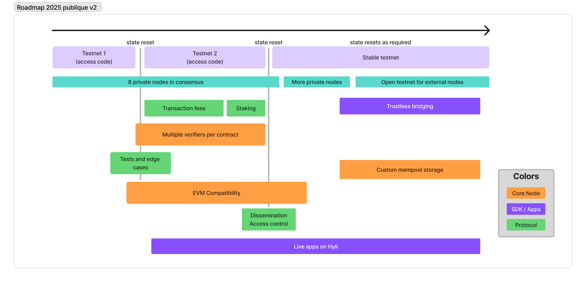

Hyli is continuously evolving toward a faster, simpler, and more interoperable proof-powered network for private, compliant financial infrastructure.

## Current phase: Private Mainnet

Our private mainnet is live and running.

We are currently onboarding launch partners (licensed stablecoin issuers, tokenization platforms, and financial institutions) to deploy production applications in a controlled environment.

While the network is operational, access is currently limited to selected partners. If you're building private, compliant financial applications and want to join the private mainnet, [reach out](./partnerships.md)!

Stay tuned on our social channels for updates or reach out if you're building private, compliant financial applications.